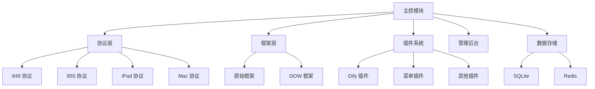

#  XxxBot

<div align="center">


**基于微信的多功能智能机器人系统**

</div>

<div align="center">

[快速开始](#-快速开始) |
[主要特性](#-主要特性) |
[部署指南](#-部署指南) |
[配置指南](#-配置指南) |
[使用指南](#-使用指南) |
[插件开发](#-插件开发) |
[常见问题](#-常见问题)

</div>

---

## ⚠️ 免责声明

**本项目仅供学习交流使用，严禁用于商业用途！**  
使用本项目所产生的一切法律责任和风险，由使用者自行承担，与项目作者无关。  
请遵守相关法律法规，合法合规使用本项目。

---

## 📖 什么是 XxxBot？

XxxBot 是一个基于微信的多功能智能机器人系统，通过整合多种 API 和功能，提供丰富的交互体验。系统包含完整的管理后台界面，支持插件扩展，具备联系人管理、文件管理、系统状态监控等功能，并与人工智能服务集成，提供智能对话能力。

XxxBot 支持多种微信接口和协议，包括 PAD 协议和 Mac 协议，可根据需要灵活切换，满足不同场景下的部署需求。

<details>
<summary><b>🔄 系统架构图</b>（点击展开）</summary>
<br>
<div align="center">

</div>
</details>

---

## ✨ 主要特性

<table>
  <tr>
    <td width="50%">
      <h3>🔌 多协议支持</h3>
      <ul>
        <li>支持 849（iPad）、855（安卓PAD）、ipad 和 Mac 协议</li>
        <li>可灵活切换，满足不同场景需求</li>
        <li>自动适配 API 路径，确保功能正常工作</li>
      </ul>
    </td>
    <td width="50%">
      <h3>🔄 双框架模式</h3>
      <ul>
        <li>支持同时运行原始框架和 DOW 框架</li>
        <li>通过回调机制实现框架间通信</li>
        <li>扩展更多功能，提高系统稳定性</li>
      </ul>
    </td>
  </tr>
  <tr>
    <td width="50%">
      <h3>🧩 插件系统</h3>
      <ul>
        <li>完善的插件架构，易于扩展</li>
        <li>支持热插拔功能，无需重启</li>
        <li>丰富的插件库，满足多样需求</li>
      </ul>
    </td>
    <td width="50%">
      <h3>🤖 智能对话</h3>
      <ul>
        <li>集成多种 AI 模型，支持模型切换</li>
        <li>图文结合理解能力</li>
        <li>函数调用功能，实现智能操作</li>
      </ul>
    </td>
  </tr>
  <tr>
    <td width="50%">
      <h3>🖼️ 图片识别</h3>
      <ul>
        <li>支持引用图片识别功能</li>
        <li>让 AI 分析图片内容并回答问题</li>
        <li>支持多种图片格式处理</li>
      </ul>
    </td>
    <td width="50%">
      <h3>💻 管理后台</h3>
      <ul>
        <li>现代化的 Web 管理界面</li>
        <li>提供完整的系统管理功能</li>
        <li>实时统计和监控</li>
      </ul>
    </td>
  </tr>
</table>

---

## 🚀 快速开始

<table>
  <tr>
    <td width="60%">
      <h3>💬 加入 XxxBot 交流群</h3>
      <p>扫描右侧的二维码加入官方交流群，获取：</p>
      <ul>
        <li>💡 <strong>最新功能更新</strong>和使用技巧</li>
        <li>👨‍💻 <strong>技术支持</strong>和问题解答</li>
        <li>👥 与其他用户<strong>交流经验</strong></li>
        <li>📝 <strong>插件开发</strong>和定制化帮助</li>
      </ul>
    </td>
    <td width="40%" align="center">
      
      <p><strong>XxxBot 官方交流群</strong></p>
    </td>
  </tr>
</table>

---

## 🔧 系统架构

XxxBot 采用模块化的设计架构，主要由以下部分组成：

<div align="center">



</div>

- **主控模块**：负责整体控制和消息转发
- **协议层**：负责与微信通信，支持多种协议版本
- **框架层**：原始框架和 DOW 框架，提供基础功能
- **插件系统**：用于扩展系统功能
- **管理后台**：提供 Web 界面管理系统
- **数据存储**：使用 SQLite 和 Redis 存储数据

---

## 📦 部署指南

### 系统要求

- 🐍 Python 3.11+
- 📱 WX 客户端
- 🔋 Redis（用于数据缓存）
- 🎥 FFmpeg（用于语音处理）
- 🐳 Docker（可选，用于容器化部署）

### 安装方法

#### 🔹 方法一：直接安装

<details open>
<summary><b>详细步骤</b></summary>

1. **克隆代码库**

   ```bash
   git clone https://github.com/NanSsye/xxxbot-pad.git
   cd xxxbot-pad
   ```

2. **安装依赖**

   ```bash
   pip install -r requirements.txt
   ```

3. **安装 Redis 和 FFmpeg**

     ```bash
     # Ubuntu/Debian
sudo apt update
sudo apt install redis-server ffmpeg

# macOS
brew install redis ffmpeg

# Windows
# 下载并安装 Redis 和 FFmpeg
```

4. **配置系统**

复制 `main_config.toml.example` 为 `main_config.toml` 并填写配置

5. **启动服务**

     ```bash
# 先启动 Redis 服务
cd 849/redis
redis-server redis.conf

# 启动 PAD 服务（根据协议版本选择）
cd ../pad  # 或 pad2, pad3 取决于协议版本
./main

# 启动主程序
   python main.py
   ```

</details>

#### 🔹 方法二：Docker 安装

<details>
<summary><b>详细步骤</b></summary>

使用 Docker Compose 一键部署：

   ```bash
   # 克隆代码库
   git clone https://github.com/NanSsye/xxxbot-pad.git
   cd xxxbot-pad

   # 启动服务
   docker-compose up -d
   ```

Docker 环境会自动启动 Redis 和 PAD 服务，无需手动启动。

</details>

### 访问管理后台

- 🌐 打开浏览器访问 `http://localhost:9090` 进入管理界面
- 👤 默认用户名：`admin`
- 🔑 默认密码：`admin1234`

---

## ⚙️ 配置指南

### 协议配置

在 `main_config.toml` 文件中配置微信协议版本：

```toml
[Protocol]
version = "849"  # 可选值: "849", "855", "ipad", "Mac"
```

| 协议版本 | 适用客户端 | API 路径前缀 |
|---------|----------|------------|
| 849 | iPad 版本 | `/VXAPI` |
| 855 | 安卓 PAD 版本 | `/api` |
| ipad | 新版 iPad 协议 | `/api` |
| Mac | Mac 协议 | `/api` |

### 框架配置

选择框架运行模式：

```toml
[Framework]
type = "default"  # 可选值: "default" 或 "dual"
```

- **default**: 使用原始框架
- **dual**: 双框架模式，同时运行原始框架和 DOW 框架

### 系统通知配置

配置系统通知功能：

```toml
[Notification]
enabled = true                      # 是否启用通知功能
token = "your_pushplus_token"       # PushPlus Token
channel = "wechat"                  # 通知渠道

[Notification.triggers]
offline = true                      # 微信离线时通知
reconnect = true                    # 微信重新连接时通知
restart = true                      # 系统重启时通知
error = true                        # 系统错误时通知
```

### Dify 插件配置

集成 Dify AI 对话功能：

```toml
[Dify]
enable = true
default-model = "model1"
commands = ["ai", "机器人", "gpt"]

[Dify.models.model1]
api-key = "your_api_key"
base-url = "https://api.dify.ai/v1"
trigger-words = ["dify", "小d"]
price = 10
wakeup-words = ["你好小d", "嘿小d"]
```

---

## 📱 使用指南

### 管理员功能

管理员可以通过管理后台或直接向机器人发送特定命令进行管理：

<details>
<summary><b>管理员命令列表</b>（点击展开）</summary>

- `/status` - 查看系统状态
- `/restart` - 重启机器人
- `/plugin list` - 列出所有插件
- `/plugin enable <插件名>` - 启用插件
- `/plugin disable <插件名>` - 禁用插件
- `/grant <wxid>` - 授予用户权限
- `/revoke <wxid>` - 撤销用户权限

</details>

### 用户交互

#### 私聊模式

直接向机器人发送消息即可开始对话。

#### 群聊模式

- **@机器人 + 问题** - 直接在群里@机器人后提问
- **使用指令前缀** - 如：`ai 今天天气怎么样？`
- **使用唤醒词** - 如：`你好小d 今天天气怎么样？`

### 聊天室功能

XxxBot 支持聊天室模式，支持多人持续对话：

- **加入聊天**：@机器人或使用命令进入聊天模式
- **查看状态**：发送"查看状态"
- **暂时离开**：发送"暂时离开"
- **退出聊天**：发送"退出聊天"

### 图片和语音交互

- **图片提问**：发送图片和文字组合进行图像相关提问
- **引用图片识别**：引用一条图片消息，机器人会分析图片内容
- **语音交互**：支持语音输入识别和语音回复
- **语音撒娇**：特殊的语音互动功能

---

## 🧩 插件开发

XxxBot 提供了完善的插件系统，可以扩展各种功能。

### 插件目录结构

```
plugins/
  ├── YourPlugin/
  │   ├── __init__.py
  │   ├── main.py
  │   ├── config.toml
  │   └── README.md
```

### 基本插件模板

```python
from utils.plugin_base import PluginBase
from WechatAPI import WechatAPIClient
from utils.decorators import *

class YourPlugin(PluginBase):
    description = "插件描述"
    author = "作者名称"
    version = "1.0.0"

    def __init__(self):
        super().__init__()
        # 初始化代码

    @on_text_message(priority=10)
    async def handle_text(self, bot: WechatAPIClient, message: dict):
        # 处理文本消息
        pass
```

<details>
<summary><b>更多插件开发示例</b>（点击展开）</summary>

#### 定时任务插件

```python
from utils.plugin_base import PluginBase
import asyncio

class TimerPlugin(PluginBase):
    description = "定时任务插件"
    author = "XxxBot Team"
    version = "1.0.0"

    def __init__(self):
        super().__init__()
        self.tasks = {}
        
    async def setup(self):
        # 启动定时任务
        self.tasks['daily_report'] = asyncio.create_task(self.daily_report())
        
    async def daily_report(self):
        while True:
            # 每天早上8点发送报告
            await self.send_daily_report()
            await asyncio.sleep(86400)  # 等待24小时
```

#### 事件响应插件

```python
from utils.plugin_base import PluginBase
from utils.decorators import *

class EventPlugin(PluginBase):
    description = "事件响应插件"
    author = "XxxBot Team"
    version = "1.0.0"

    @on_friend_added(priority=10)
    async def handle_friend_added(self, bot, event):
        # 处理新好友添加事件
        await bot.send_text(event['wxid'], "感谢添加我为好友！")
```

</details>

---

## ❓ 常见问题

<details>
<summary><b>安装问题</b></summary>

- **依赖安装失败**：尝试更新 pip 或安装开发工具
  ```bash
  pip install --upgrade pip
  apt-get install python3-dev  # Ubuntu/Debian
  ```

- **Redis 连接错误**：确认 Redis 服务是否正常运行，端口是否为 6378
  ```bash
  # 检查 Redis 服务状态
  redis-cli -p 6378 ping
  ```

- **Docker 部署问题**：查看容器日志，确认服务是否正常启动
  ```bash
  docker logs xxxbot-pad
  ```
</details>

<details>
<summary><b>连接问题</b></summary>

- **无法连接微信**：确认协议版本设置是否正确，PAD 服务是否运行
  ```bash
  # 检查 PAD 服务是否运行
  ps aux | grep pad
  ```

- **无法访问管理后台**：确认服务是否运行在 9090 端口
  ```bash
  # 检查端口占用
  netstat -tulpn | grep 9090
  ```

- **DOW 框架不工作**：检查框架设置和回调 URL 配置
  ```bash
  # 检查日志
  tail -f logs/dow.log
  ```
</details>

<details>
<summary><b>功能问题</b></summary>

- **语音识别失败**：确认 FFmpeg 安装和配置
  ```bash
  # 测试 FFmpeg 安装
  ffmpeg -version
  ```

- **Dify API 错误**：验证 API 密钥和 URL 是否正确
  ```bash
  # 可以使用 curl 测试 API 连接
  curl -H "Authorization: Bearer YOUR_API_KEY" https://api.dify.ai/v1/health
  ```

- **图片无法发送**：检查文件权限和临时目录配置
</details>

---

## 📊 界面展示

<div align="center">
<table>
  <tr>
    <td width="50%">
      
      <p align="center">控制面板</p>
    </td>
    <td width="50%">
      
      <p align="center">插件管理</p>
    </td>
  </tr>
  <tr>
    <td width="50%">
      
      <p align="center">系统状态</p>
    </td>
    <td width="50%">
      
      <p align="center">文件管理</p>
    </td>
  </tr>
</table>

<table>
  <tr>
    <td width="33%">
      
      <p align="center">移动端界面</p>
    </td>
    <td width="33%">
      
      <p align="center">设置页面</p>
    </td>
    <td width="33%">
      
      <p align="center">聊天界面</p>
    </td>
  </tr>
</table>
</div>

---

## 📞 联系与支持

加入 XxxBot 官方交流群，获取最新功能更新和技术支持：

<div align="center">

<p><strong>XxxBot 官方交流群</strong></p>
</div>

感谢支持：
<div align="center">

<p><strong>感谢赞助</strong></p>
</div>

---

<div align="center">

**XxxBot** © 2024 [NanSsye](https://github.com/NanSsye). 基于 [MIT 许可证](LICENSE) 开源。

</div>
